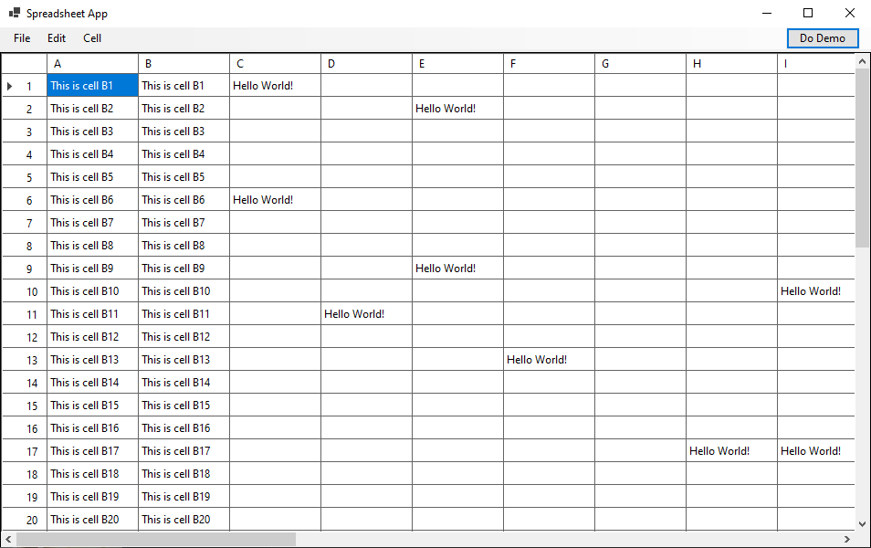
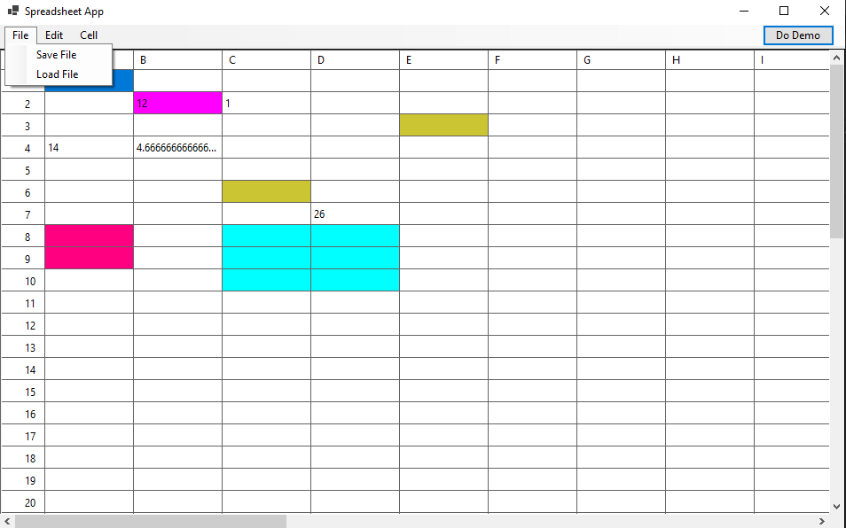
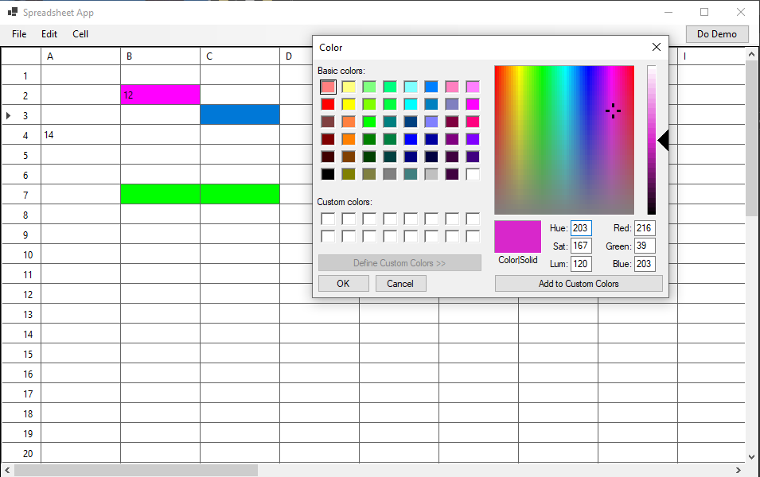
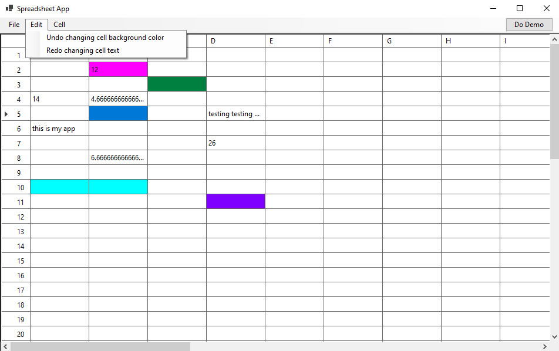

# Spreadsheet Desktop Application

A Windows Forms spreadsheet application built with C# that supports basic spreadsheet functionality including formula evaluation, cell dependencies, and undo/redo capabilities.

| Main Interface | File Save/Load |
|:--------------:|:------------------:|
|  |  |
| Interactive 26x50 grid with column headers (A-Z) and row numbers. Clean Windows Forms interface with menu bar for file operations and editing commands. | Demonstrates file save and load functionality with XML format. Image also shows formula evaluations in cells with calculated results. |

| **Color Customization** | **Edit Functionality** |
|:----------------------:|:------------------:|
|  |  |
| Background color customization for individual cells or selected ranges. Right-click context menu provides easy access to color options. | Demonstrates undo and redo functionality for edit operations. Shows how changes to cell values and formatting can be easily reversed or restored. |

## How to Run

To run the application (Windows 10/11 devices):

1. Navigate to the application directory/folder
2. Double-click the `Spreadsheet.exe` executable
3. The application will launch and open the main spreadsheet interface

## Features

- Interactive spreadsheet grid with 26 columns (A-Z) and 50 rows
- Formula evaluation with basic arithmetic operations (+, -, *, /)
- Cell referencing (e.g., =A1+B2)
- Circular reference detection
- Background color customization for cells
- Undo/redo functionality
- Save/Load spreadsheet data in XML format

## Error Handling

The application handles various error cases:
- Circular references: `!(circular reference)`
- Self references: `!(self reference)`
- Invalid cell references: `!(bad reference)`
- Empty formulas: `!(empty formula)`

## Technical Details

- Built with .NET 8.0
- Uses Windows Forms for UI
- Implements the Command pattern for undo/redo operations
- Expression tree evaluation for formulas
- XML serialization for file I/O

## Project Structure

- `SpreadsheetEngine/`: Core spreadsheet logic and data structures
- `ExpressionTree_Demo/`: Expression tree evaluation demo
- `SpreadsheetTests/`: Unit tests
- `Spreadsheet/`: Windows Forms UI application
